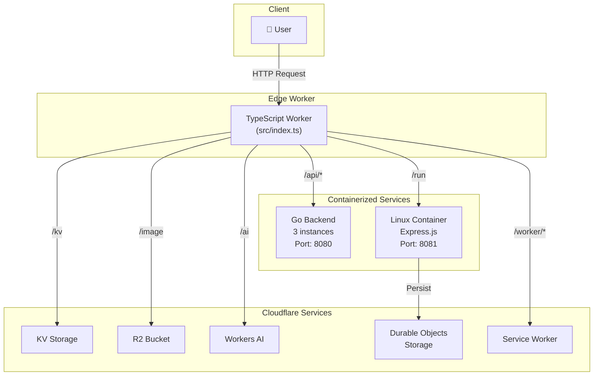

# Cloudflare Containers Demo - Full Stack Application

## 🌍 Distributed Computing on Cloudflare's Global Network

This project demonstrates a modern full-stack application built entirely on Cloudflare's platform, showcasing the power of edge computing with containerized workloads.

> **"The Network is the Computer"** - Deploy to 300+ cities worldwide with a single command: `wrangler deploy`

## 🚀 Key Features

### Dual Container Architecture
- **Go Backend Container** (`GoBackend`)
  - Handles API endpoints at `/api/*`
  - Provides JSON responses, heavy compute operations, and header inspection
  - Auto-scaling with load balancing across 3 instances
  - Internet access enabled for external API calls

- **Linux Command Container** (`LinuxCommandContainer`)
  - Secure command execution environment at `/run`
  - Express.js server for handling Linux commands
  - Persistent storage via Durable Objects
  - Automatic timestamp tracking for requests

### Platform Services Integration
- **Edge Routing:** TypeScript Worker with intelligent request routing
- **Persistent Storage:** Cloudflare KV and Durable Objects
- **Object Storage:** R2 bucket with dynamic image optimization
- **AI Inference:** Workers AI for LLM capabilities
- **Service Bindings:** Worker-to-Worker communication
- **Security:** Secrets Store integration

---

## 🏗️ Architecture Overview



---

## 📍 API Endpoints

| Endpoint | Resource | Description |
|----------|----------|-------------|
| `/test1` | Worker Direct | Simple "Hello, World!" response |
| `/test2` | External Fetch | Proxies to httpbin.org with custom headers |
| `/api/*` | Go Container | Backend API services |
| `/api/api1` | Go Container | Returns simple JSON response |
| `/api/heavycompute` | Go Container | Fibonacci computation for load testing |
| `/api/responseheaders` | Go Container | Echoes request headers as JSON |
| `/run` | Linux Container | Command execution (GET: health, POST: execute) |
| `/kv` | KV Namespace | Fetches value for key "demo-key" |
| `/image` | R2 + Image Transform | Dynamic image resizing (params: width, height) |
| `/ai` | Workers AI | LLM inference (param: ?prompt=) |
| `/worker/*` | Service Binding | Routes to service worker |
| `/` | Static Assets | Frontend UI from /dist |

---

## 📁 Project Structure

```
cloudflare-containers-go/
├── src/
│   └── index.ts              # Main Worker entry point with routing logic
├── container_src/            # Go backend container
│   ├── main.go              # HTTP server with API endpoints
│   └── go.mod               # Go dependencies
├── linux_container_src/      # Linux command execution container
│   ├── server.js            # Express.js server
│   └── package.json         # Node.js dependencies
├── dist/                     # Frontend assets
│   └── index.html           # Interactive UI
├── Dockerfile               # Go backend container image
├── Dockerfile.linux         # Linux container image
├── wrangler.jsonc           # Cloudflare configuration
├── package.json             # Project dependencies
└── README.md               # This file
```

---

## 🔧 Technical Implementation

### Container Classes (`src/index.ts`)

#### GoBackend Class
```typescript
- Port: 8080
- Sleep After: 2 hours
- Autoscale: Enabled
- Internet Access: Enabled
- Lifecycle hooks: onStart(), onStop(), onError()
```

#### LinuxCommandContainer Class
```typescript
- Port: 8081
- Sleep After: 2 hours  
- Autoscale: Enabled
- Features:
  - Automatic request timestamp storage in Durable Objects
  - Simplified fetch() method for request proxying
  - Persistent storage via ctx.storage
```

### Load Balancing
The application uses `getRandom()` from `@cloudflare/containers` to distribute requests across 3 container instances for the Go backend, ensuring optimal performance and availability.
- `POST /run` → Execute Linux commands securely (requires JSON body with `command` field)
- `GET /kv` → Returns a value from Cloudflare KV storage
- `GET /image?width=120&height=80` → Fetches and resizes an image from R2 to 120x80 (defaults to 100x100 if not specified)
- `GET /ai?prompt=...` → Runs inference using Workers AI with a custom prompt
- `GET /` → Returns the static frontend page

---

## Service Bindings Configuration

The application uses comprehensive Cloudflare service bindings to integrate with various platform services:

### **Container Bindings (Durable Objects)**

- **`BACKEND`** → `GoBackend` container (Go API services)

  - **Route:** `/api/*`
  - **Max Instances:** 3
  - **Purpose:** Handles JSON, heavy compute, and request header endpoints

- **`LINUX_COMMAND`** → `LinuxCommandContainer` (Node.js/Express)
  - **Route:** `/run`
  - **Max Instances:** 2
  - **Purpose:** Secure Linux command execution environment
  - **Recent Updates:** Refactored to use `containerFetch` for explicit port targeting (8081) and improved error handling

### **Storage Bindings**

- **`MY_KV`** → KV Namespace

  - **Route:** `/kv`
  - **ID:** `c2a03de4a9a54947bf56011ffb64a4d1`
  - **Purpose:** Key-value storage for demo data

- **`PUBLIC`** → R2 Bucket
  - **Route:** `/image`
  - **Bucket:** `public`
  - **Purpose:** Object storage with image optimization

### **AI & Compute Bindings**

- **`AI`** → Workers AI
  - **Route:** `/ai`
  - **Purpose:** LLM inference using Cloudflare's AI models

### **Worker-to-Worker Communication**

- **`WORKER_SERVICE`** → Service Binding
  - **Route:** `/worker/*`
  - **Target:** `cloudflare-containers-go-service-worker`
  - **Purpose:** Zero-latency inter-worker communication

### **Security Bindings**

- **`SECRET_STORE`** → Secrets Store
  - **Store ID:** `17b1a325d8084ec087e87dda53cffd6b`
  - **Secret:** `ACCOUNT_API_KEY`
  - **Purpose:** Secure secret management (configured but not actively used)

### **Configuration in `wrangler.jsonc`:**

```jsonc
{
  "durable_objects": {
    "bindings": [
      { "class_name": "GoBackend", "name": "BACKEND" },
      { "class_name": "LinuxCommandContainer", "name": "LINUX_COMMAND" }
    ]
  },
  "kv_namespaces": [
    { "binding": "MY_KV", "id": "c2a03de4a9a54947bf56011ffb64a4d1" }
  ],
  "r2_buckets": [{ "binding": "PUBLIC", "bucket_name": "public" }],
  "ai": { "binding": "AI" },
  "services": [
    {
      "binding": "WORKER_SERVICE",
      "service": "cloudflare-containers-go-service-worker"
    }
  ],
  "secrets_store_secrets": [
    {
      "binding": "SECRET_STORE",
      "store_id": "17b1a325d8084ec087e87dda53cffd6b"
    }
  ]
}
```

---

## Secrets Store Configuration

The application is configured with Cloudflare Secrets Store for secure secret management:

- **Binding:** `SECRET_STORE` (defined in `wrangler.jsonc`)
- **Store ID:** `17b1a325d8084ec087e87dda53cffd6b`
- **Secret Name:** `ACCOUNT_API_KEY`
- **Usage:** Currently configured but not actively used by any endpoints
- **Purpose:** Ready for future implementation of secure API key management or other sensitive data handling

To use the secret in your code:

```typescript
// In your worker's fetch handler
const secretValue = await env.SECRET_STORE.get();
```

---

## Go Backend (net/http)

- **Framework:** Standard Go [`net/http`](https://pkg.go.dev/net/http)
- **Endpoints:**
  - `/api/api1` (returns a simple JSON response)
  - `/api/heavycompute` (runs a heavy compute operation and returns the result)
  - `/api/responseheaders` (returns the incoming request headers as JSON)
- **Port:** Listens on port `8080` (required by Cloudflare Containers)
- **Build:** Compiled as a single static binary using Go modules

---

## Linux Command Container (Express.js)

- **Framework:** [Express.js](https://expressjs.com/) on [Node.js](https://nodejs.org/)
- **Base Image:** Alpine Linux with essential system utilities
- **Endpoints:**
  - `GET /` (health check - returns service status and timestamp)
  - `POST /run` (secure command execution - accepts JSON with `command` field)
- **Port:** Listens on port `8081` (different from Go container)
- **Security Features:**
  - Command validation and dangerous command filtering
  - 30-second execution timeout
  - Sandboxed execution in `/tmp` directory
  - Non-root user execution (nodejs:nodejs)
- **Available Tools:** bash, curl, wget, git, jq, python3, vim, htop, and more
- **Response Format:** JSON with command output, error messages, exit codes, and execution timestamps
- **Use Cases:**
  - System diagnostics (`ls -la`, `ps aux`, `df -h`)
  - Network testing (`curl`, `wget`)
  - Development utilities (`git`, `jq`, `python3`)
  - System monitoring (`htop`, `free -h`, `uname -a`)

### Request Flow for `/run` Endpoint

1. **Request hits `/run`** → Routes to `LinuxCommandContainer` Durable Object
2. **Stores timestamp** → Records current date/time in Durable Object storage
3. **Starts container** → Ensures the Docker container is running (`await this.start()`)
4. **Proxies request** → Forwards the request to your actual container application (Express.js app running on port 8081)
5. **Returns container response** → The actual response from your container application

- **Timestamp Storage:** Each request automatically stores the current date/time in Durable Object storage as `lastRequestTimestamp`
- **Auto-scaling:** Container starts on-demand and scales down after inactivity
- **Fallback Handling:** Returns error response if container is unavailable

**Example Request:**

```bash
curl -X POST https://go.zxc.co.in/run \
  -H "Content-Type: application/json" \
  -d '{"command": "ls -la"}'
```

**Example Response:**

```json
{
  "success": true,
  "command": "ls -la",
  "output": "total 12\ndrwxrwxrwt 1 root root 4096 Jan 1 12:00 .\n...",
  "error": "",
  "exit_code": 0,
  "timestamp": 1642781234.567
}
```

---

## Building and Deploying

### Go Backend

- Built using Go modules:
  - `go build -o /server` (inside the Docker build)
- **Dockerfile:** Multi-stage build
  - **Build stage:** Compiles the Go binary in an Alpine environment
  - **Runtime stage:** Copies the binary into a minimal scratch image
- **Entrypoint:** Backend binary is `/server` and listens on port 8080

### Static Frontend

- Located in the `dist/` directory
- Served directly by Cloudflare Workers for non-API routes

### Deployment

- Use [Wrangler](https://developers.cloudflare.com/workers/wrangler/) to deploy:
  - `npx wrangler deploy`
- Wrangler handles asset upload, Worker deployment, and container image build/push
- Cloudflare automatically manages container scaling and routing

---

## License

MIT License

Copyright (c) 2025 Cloudflare Containers Demo

Permission is hereby granted, free of charge, to any person obtaining a copy
of this software and associated documentation files (the "Software"), to deal
in the Software without restriction, including without limitation the rights
to use, copy, modify, merge, publish, distribute, sublicense, and/or sell
copies of the Software, and to permit persons to whom the Software is
furnished to do so, subject to the following conditions:

The above copyright notice and this permission notice shall be included in all
copies or substantial portions of the Software.

THE SOFTWARE IS PROVIDED "AS IS", WITHOUT WARRANTY OF ANY KIND, EXPRESS OR
IMPLIED, INCLUDING BUT NOT LIMITED TO THE WARRANTIES OF MERCHANTABILITY,
FITNESS FOR A PARTICULAR PURPOSE AND NONINFRINGEMENT. IN NO EVENT SHALL THE
AUTHORS OR COPYRIGHT HOLDERS BE LIABLE FOR ANY CLAIM, DAMAGES OR OTHER
LIABILITY, WHETHER IN AN ACTION OF CONTRACT, TORT OR OTHERWISE, ARISING FROM,
OUT OF OR IN CONNECTION WITH THE SOFTWARE OR THE USE OR OTHER DEALINGS IN THE
SOFTWARE.
