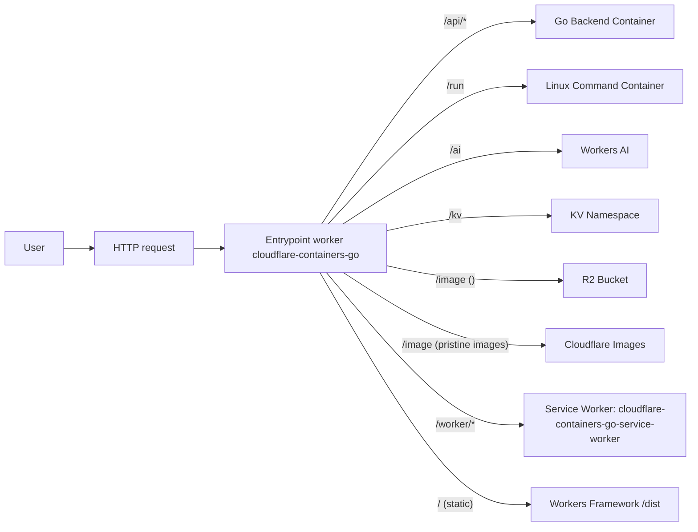

## Distributed Full Stack Application on Global Network | [Network is the Computer](https://blog.cloudflare.com/the-network-is-the-computer/)

Think of the Cloudflare Network as a single, global computer operating across 300+ cities. When you deploy to Cloudflare, your application is deployed to "Region Earth" - a unified global region. The platform takes care of intelligent routing, seamless scaling, performance optimization, and robust security, all while delivering a world-class developer experience.

Use your favourite IDE > run `wrangler deploy` > Application is instantly deployed to the massive distributed computer

---

This project demonstrates a modern full stack application built entirely on Cloudflare's platform with an optimized dual-container architecture:

- **Frontend:** Clean, organized UI served via Workers framework with separate sections for API, Image, AI, and Linux command controls
- **Routing:** Intelligent TypeScript Worker with streamlined routing logic
- **Dual Container Backend:**
  - **Go Container** (`GoBackend`): Handles API endpoints (`/api/*`) for JSON responses, heavy compute, and request headers
  - **Linux Container** (`LinuxCommandContainer`): Secure command execution environment (`/run`) with Express.js
- **Database:** Cloudflare KV and Durable Objects for persistent storage
- **Storage:** Cloudflare R2 with integrated image optimization
- **AI:** Cloudflare Workers AI for LLM inference
- **Image Processing:** Cloudflare Images with dynamic resizing
- **Security:** Secrets Store integration and sandboxed command execution
- **Service Bindings:** Worker-to-Worker communication for microservices architecture

The architecture showcases how to combine edge compute, dual container orchestration, serverless storage, AI inference, and secure command execution to build scalable, performant applications with minimal infrastructure management.

---

## Architecture Overview



---

## Endpoint to Resource Mapping

| Endpoint Pattern      | Cloudflare Resource        | Description                                                                    |
| --------------------- | -------------------------- | ------------------------------------------------------------------------------ |
| `/api/*`              | Durable Object (Container) | Proxies to Go backend container                                                |
| `/run`                | Durable Object (Container) | Linux command execution container (GET for health, POST for commands)          |
| `/kv`                 | KV Namespace               | Fetches value from Cloudflare KV                                               |
| `/image`              | R2 Bucket + Images         | Fetches and resizes image from R2 (user-defined width/height, default 100x100) |
| `/ai`                 | Workers AI                 | Runs inference using Workers AI (custom prompt via `?prompt=`)                 |
| `/worker/*`           | Service Binding            | Routes to bound service worker `cloudflare-containers-go-service-worker`       |
| `/` (static frontend) | Static Asset               | Served from Worker/dist                                                        |

**Note:** The application also has Cloudflare Secrets Store configured (`SECRET_STORE` binding) for secure secret management, though it's not currently utilized by any active endpoints.

---

## Project Structure

```
cloudflare-containers-go/
├── container_src/         # Go backend source code (net/http API)
│   ├── main.go            # Main Go application entrypoint
│   └── go.mod             # Go module manifest
├── linux_container_src/   # Linux Command Container source code (Node.js/Express)
│   ├── server.js          # Express.js server for command execution
│   └── package.json       # Node.js dependencies
├── dist/                  # Static frontend assets (HTML/JS)
│   └── index.html         # Enhanced frontend with organized UI sections
├── src/
│   └── index.ts           # Cloudflare Worker entrypoint (TypeScript)
├── Dockerfile.gobackend   # Multi-stage build for Go backend container
├── Dockerfile.linux       # Alpine-based build for Linux Command Container
├── wrangler.jsonc         # Cloudflare deployment configuration
└── README.md              # Project documentation
```

---

## How Routing Works (`src/index.ts`)

- **Entrypoint:** `src/index.ts` (TypeScript)
- **Routing logic:**
  - Requests to `/api/*` are proxied to backend containers (Go services) using Cloudflare's container orchestration.
  - Requests to `/run` are proxied to Linux Command Container for secure command execution.
  - `/kv` fetches from Cloudflare KV.
  - `/image` fetches and resizes an image from R2 using Cloudflare Images (`cf: { image: ... }`).
  - `/ai` runs inference using Workers AI (prompt customizable via query param).
  - All other requests (e.g., `/`) return static assets (the frontend HTML/JS in `dist/`).
- **Load Balancing:**
  - The Worker uses the `getRandom` helper from `@cloudflare/containers` to distribute API requests across multiple backend container instances.

**Example:**

- `GET /api/api1` → Routed to a Go container instance
- `GET /api/heavycompute` → Routed to a Go container instance, runs a heavy compute (Fibonacci) for load testing
- `GET /api/responseheaders` → Routed to a Go container instance, returns the incoming request headers as JSON
- `GET /run` → Health check for Linux Command Container
- `POST /run` → Execute Linux commands securely (requires JSON body with `command` field)
- `GET /kv` → Returns a value from Cloudflare KV storage
- `GET /image?width=120&height=80` → Fetches and resizes an image from R2 to 120x80 (defaults to 100x100 if not specified)
- `GET /ai?prompt=...` → Runs inference using Workers AI with a custom prompt
- `GET /` → Returns the static frontend page

---

## Service Bindings Configuration

The application uses comprehensive Cloudflare service bindings to integrate with various platform services:

### **Container Bindings (Durable Objects)**

- **`BACKEND`** → `GoBackend` container (Go API services)

  - **Route:** `/api/*`
  - **Max Instances:** 3
  - **Purpose:** Handles JSON, heavy compute, and request header endpoints

- **`LINUX_COMMAND`** → `LinuxCommandContainer` (Node.js/Express)
  - **Route:** `/run`
  - **Max Instances:** 2
  - **Purpose:** Secure Linux command execution environment
  - **Recent Updates:** Refactored to use `containerFetch` for explicit port targeting (8081) and improved error handling

### **Storage Bindings**

- **`MY_KV`** → KV Namespace

  - **Route:** `/kv`
  - **ID:** `c2a03de4a9a54947bf56011ffb64a4d1`
  - **Purpose:** Key-value storage for demo data

- **`PUBLIC`** → R2 Bucket
  - **Route:** `/image`
  - **Bucket:** `public`
  - **Purpose:** Object storage with image optimization

### **AI & Compute Bindings**

- **`AI`** → Workers AI
  - **Route:** `/ai`
  - **Purpose:** LLM inference using Cloudflare's AI models

### **Worker-to-Worker Communication**

- **`WORKER_SERVICE`** → Service Binding
  - **Route:** `/worker/*`
  - **Target:** `cloudflare-containers-go-service-worker`
  - **Purpose:** Zero-latency inter-worker communication

### **Security Bindings**

- **`SECRET_STORE`** → Secrets Store
  - **Store ID:** `17b1a325d8084ec087e87dda53cffd6b`
  - **Secret:** `ACCOUNT_API_KEY`
  - **Purpose:** Secure secret management (configured but not actively used)

### **Configuration in `wrangler.jsonc`:**

```jsonc
{
  "durable_objects": {
    "bindings": [
      { "class_name": "GoBackend", "name": "BACKEND" },
      { "class_name": "LinuxCommandContainer", "name": "LINUX_COMMAND" }
    ]
  },
  "kv_namespaces": [
    { "binding": "MY_KV", "id": "c2a03de4a9a54947bf56011ffb64a4d1" }
  ],
  "r2_buckets": [{ "binding": "PUBLIC", "bucket_name": "public" }],
  "ai": { "binding": "AI" },
  "services": [
    {
      "binding": "WORKER_SERVICE",
      "service": "cloudflare-containers-go-service-worker"
    }
  ],
  "secrets_store_secrets": [
    {
      "binding": "SECRET_STORE",
      "store_id": "17b1a325d8084ec087e87dda53cffd6b"
    }
  ]
}
```

---

## Secrets Store Configuration

The application is configured with Cloudflare Secrets Store for secure secret management:

- **Binding:** `SECRET_STORE` (defined in `wrangler.jsonc`)
- **Store ID:** `17b1a325d8084ec087e87dda53cffd6b`
- **Secret Name:** `ACCOUNT_API_KEY`
- **Usage:** Currently configured but not actively used by any endpoints
- **Purpose:** Ready for future implementation of secure API key management or other sensitive data handling

To use the secret in your code:

```typescript
// In your worker's fetch handler
const secretValue = await env.SECRET_STORE.get();
```

---

## Go Backend (net/http)

- **Framework:** Standard Go [`net/http`](https://pkg.go.dev/net/http)
- **Endpoints:**
  - `/api/api1` (returns a simple JSON response)
  - `/api/heavycompute` (runs a heavy compute operation and returns the result)
  - `/api/responseheaders` (returns the incoming request headers as JSON)
- **Port:** Listens on port `8080` (required by Cloudflare Containers)
- **Build:** Compiled as a single static binary using Go modules

---

## Linux Command Container (Express.js)

- **Framework:** [Express.js](https://expressjs.com/) on [Node.js](https://nodejs.org/)
- **Base Image:** Alpine Linux with essential system utilities
- **Endpoints:**
  - `GET /` (health check - returns service status and timestamp)
  - `POST /run` (secure command execution - accepts JSON with `command` field)
- **Port:** Listens on port `8081` (different from Go container)
- **Security Features:**
  - Command validation and dangerous command filtering
  - 30-second execution timeout
  - Sandboxed execution in `/tmp` directory
  - Non-root user execution (nodejs:nodejs)
- **Available Tools:** bash, curl, wget, git, jq, python3, vim, htop, and more
- **Response Format:** JSON with command output, error messages, exit codes, and execution timestamps
- **Use Cases:**
  - System diagnostics (`ls -la`, `ps aux`, `df -h`)
  - Network testing (`curl`, `wget`)
  - Development utilities (`git`, `jq`, `python3`)
  - System monitoring (`htop`, `free -h`, `uname -a`)

### Request Flow for `/run` Endpoint

1. **Request hits `/run`** → Routes to `LinuxCommandContainer` Durable Object
2. **Stores timestamp** → Records current date/time in Durable Object storage
3. **Starts container** → Ensures the Docker container is running (`await this.start()`)
4. **Proxies request** → Forwards the request to your actual container application (Express.js app running on port 8081)
5. **Returns container response** → The actual response from your container application

- **Timestamp Storage:** Each request automatically stores the current date/time in Durable Object storage as `lastRequestTimestamp`
- **Auto-scaling:** Container starts on-demand and scales down after inactivity
- **Fallback Handling:** Returns error response if container is unavailable

**Example Request:**

```bash
curl -X POST https://go.zxc.co.in/run \
  -H "Content-Type: application/json" \
  -d '{"command": "ls -la"}'
```

**Example Response:**

```json
{
  "success": true,
  "command": "ls -la",
  "output": "total 12\ndrwxrwxrwt 1 root root 4096 Jan 1 12:00 .\n...",
  "error": "",
  "exit_code": 0,
  "timestamp": 1642781234.567
}
```

---

## Building and Deploying

### Go Backend

- Built using Go modules:
  - `go build -o /server` (inside the Docker build)
- **Dockerfile:** Multi-stage build
  - **Build stage:** Compiles the Go binary in an Alpine environment
  - **Runtime stage:** Copies the binary into a minimal scratch image
- **Entrypoint:** Backend binary is `/server` and listens on port 8080

### Static Frontend

- Located in the `dist/` directory
- Served directly by Cloudflare Workers for non-API routes

### Deployment

- Use [Wrangler](https://developers.cloudflare.com/workers/wrangler/) to deploy:
  - `npx wrangler deploy`
- Wrangler handles asset upload, Worker deployment, and container image build/push
- Cloudflare automatically manages container scaling and routing

---

## License

MIT License

Copyright (c) 2025 Cloudflare Containers Demo

Permission is hereby granted, free of charge, to any person obtaining a copy
of this software and associated documentation files (the "Software"), to deal
in the Software without restriction, including without limitation the rights
to use, copy, modify, merge, publish, distribute, sublicense, and/or sell
copies of the Software, and to permit persons to whom the Software is
furnished to do so, subject to the following conditions:

The above copyright notice and this permission notice shall be included in all
copies or substantial portions of the Software.

THE SOFTWARE IS PROVIDED "AS IS", WITHOUT WARRANTY OF ANY KIND, EXPRESS OR
IMPLIED, INCLUDING BUT NOT LIMITED TO THE WARRANTIES OF MERCHANTABILITY,
FITNESS FOR A PARTICULAR PURPOSE AND NONINFRINGEMENT. IN NO EVENT SHALL THE
AUTHORS OR COPYRIGHT HOLDERS BE LIABLE FOR ANY CLAIM, DAMAGES OR OTHER
LIABILITY, WHETHER IN AN ACTION OF CONTRACT, TORT OR OTHERWISE, ARISING FROM,
OUT OF OR IN CONNECTION WITH THE SOFTWARE OR THE USE OR OTHER DEALINGS IN THE
SOFTWARE.
