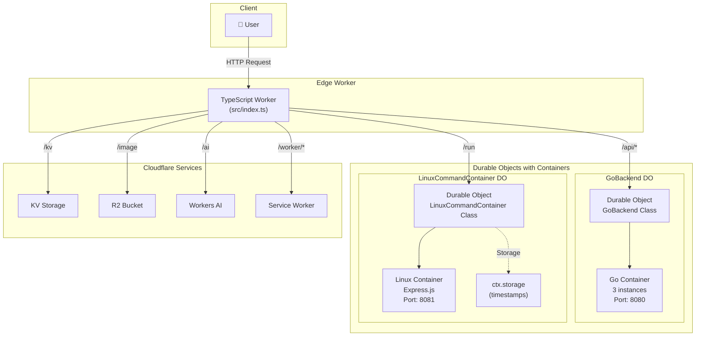

# Cloudflare Containers Demo - Full Stack Application

## 🌍 Distributed Computing on Cloudflare's Global Network

This project demonstrates a modern full-stack application built entirely on Cloudflare's platform, showcasing the power of edge computing with containerized workloads using the [Cloudflare Containers](https://github.com/cloudflare/containers) library.

> **"The Network is the Computer"** - Deploy to 300+ cities worldwide with a single command: `wrangler deploy`

## Key Features

### Platform Services Integration

- **Edge Routing:** TypeScript Worker with intelligent request routing
- **Persistent Storage:** Cloudflare KV and Durable Objects
- **Object Storage:** R2 bucket with dynamic image optimization
- **AI Inference:** Workers AI for LLM capabilities
- **Service Bindings:** Worker-to-Worker communication
- **Security:** Cloudflare DDoS, WAF, Bot Management etc

---

## 🏗️ Architecture Overview



---

## 📍 API Endpoints

| Endpoint               | Resource             | Description                                    |
| ---------------------- | -------------------- | ---------------------------------------------- |
| `/test1`               | Worker Direct        | Simple "Hello, World!" response                |
| `/test2`               | External Fetch       | Proxies to httpbin.org with custom headers     |
| `/api/*`               | Go Container         | Backend API services                           |
| `/api/api1`            | Go Container         | Returns simple JSON response                   |
| `/api/heavycompute`    | Go Container         | Fibonacci computation for load testing         |
| `/api/responseheaders` | Go Container         | Echoes request headers as JSON                 |
| `/run`                 | Linux Container      | Command execution (GET: health, POST: execute) |
| `/kv`                  | KV Namespace         | Fetches value for key "demo-key"               |
| `/image`               | R2 + Image Transform | Dynamic image resizing (params: width, height) |
| `/ai`                  | Workers AI           | LLM inference (param: ?prompt=)                |
| `/worker/*`            | Service Binding      | Routes to service worker                       |
| `/`                    | Static Assets        | Frontend UI from /dist                         |

---

## 📁 Project Structure

```
cloudflare-containers-go/
├── src/
│   └── index.ts              # Main Worker entry point with routing logic
├── container_src/            # Go backend container
│   ├── main.go              # HTTP server with API endpoints
│   └── go.mod               # Go dependencies
├── linux_container_src/      # Linux command execution container
│   ├── server.js            # Express.js server
│   └── package.json         # Node.js dependencies
├── dist/                     # Frontend assets
│   └── index.html           # Interactive UI
├── Dockerfile               # Go backend container image
├── Dockerfile.linux         # Linux container image
├── wrangler.jsonc           # Cloudflare configuration
├── package.json             # Project dependencies
└── README.md               # This file
```

---

## 🔧 Technical Implementation

### Container Classes (`src/index.ts`)

#### GoBackend Class

```typescript
- Port: 8080
- Sleep After: 2 hours
- Autoscale: Enabled
- Internet Access: Enabled
- Lifecycle hooks: onStart(), onStop(), onError()
```

#### LinuxCommandContainer Class

```typescript
- Port: 8081
- Sleep After: 2 hours
- Autoscale: Enabled
- Features:
  - Automatic request timestamp storage in Durable Objects
  - Simplified fetch() method for request proxying
  - Persistent storage via ctx.storage
```

---

## Service Bindings

### **Configuration in `wrangler.jsonc`:**

```jsonc
{
  "durable_objects": {
    "bindings": [
      { "class_name": "GoBackend", "name": "BACKEND" },
      { "class_name": "LinuxCommandContainer", "name": "LINUX_COMMAND" }
    ]
  },
  "kv_namespaces": [
    { "binding": "MY_KV", "id": "c2a03de4a9a54947bf56011ffb64a4d1" }
  ],
  "r2_buckets": [{ "binding": "PUBLIC", "bucket_name": "public" }],
  "ai": { "binding": "AI" },
  "services": [
    {
      "binding": "WORKER_SERVICE",
      "service": "cloudflare-containers-go-service-worker"
    }
  ],
  "secrets_store_secrets": [
    {
      "binding": "SECRET_STORE",
      "store_id": "17b1a325d8084ec087e87dda53cffd6b"
    }
  ]
}
```

---

## Building and Deploying

### Go Backend

- Built using Go modules:
  - `go build -o /server` (inside the Docker build)
- **Dockerfile:** Multi-stage build
  - **Build stage:** Compiles the Go binary in an Alpine environment
  - **Runtime stage:** Copies the binary into a minimal scratch image
- **Entrypoint:** Backend binary is `/server` and listens on port 8080

### Static Frontend

- Located in the `dist/` directory
- Served directly by Cloudflare Workers for non-API routes

### Deployment

- Use [Wrangler](https://developers.cloudflare.com/workers/wrangler/) to deploy:
  - `npx wrangler deploy`
- Wrangler handles asset upload, Worker deployment, and container image build/push
- Cloudflare automatically manages container scaling and routing

---

## License

MIT License

Copyright (c) 2025 Cloudflare Containers Demo

Permission is hereby granted, free of charge, to any person obtaining a copy
of this software and associated documentation files (the "Software"), to deal
in the Software without restriction, including without limitation the rights
to use, copy, modify, merge, publish, distribute, sublicense, and/or sell
copies of the Software, and to permit persons to whom the Software is
furnished to do so, subject to the following conditions:

The above copyright notice and this permission notice shall be included in all
copies or substantial portions of the Software.

THE SOFTWARE IS PROVIDED "AS IS", WITHOUT WARRANTY OF ANY KIND, EXPRESS OR
IMPLIED, INCLUDING BUT NOT LIMITED TO THE WARRANTIES OF MERCHANTABILITY,
FITNESS FOR A PARTICULAR PURPOSE AND NONINFRINGEMENT. IN NO EVENT SHALL THE
AUTHORS OR COPYRIGHT HOLDERS BE LIABLE FOR ANY CLAIM, DAMAGES OR OTHER
LIABILITY, WHETHER IN AN ACTION OF CONTRACT, TORT OR OTHERWISE, ARISING FROM,
OUT OF OR IN CONNECTION WITH THE SOFTWARE OR THE USE OR OTHER DEALINGS IN THE
SOFTWARE.
