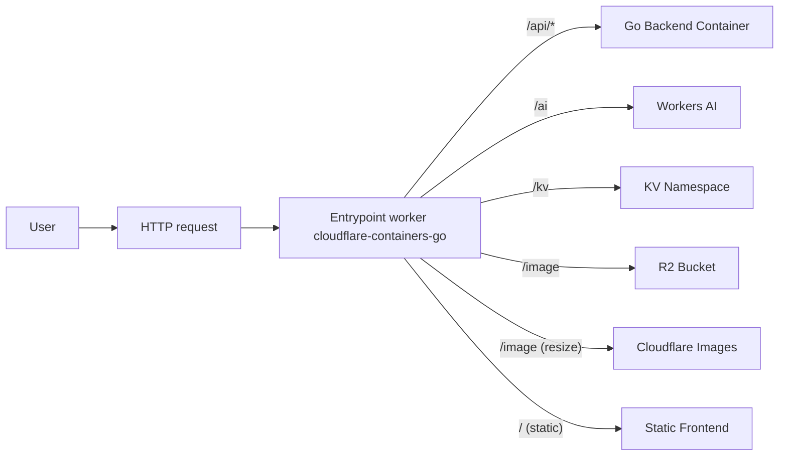

## Distributed Full Stack Application on Global Network

Think of the Cloudflare Network as a single, global computer operating across 300+ cities. When you deploy to Cloudflare, your application is deployed to "Region Earth" — a unified global region. The platform takes care of intelligent routing, seamless scaling, performance optimization, and robust security, all while delivering a world-class developer experience.

**Network is the Computer[https://blog.cloudflare.com/the-network-is-the-computer/]**

This project demonstrates a modern full stack application built entirely on Cloudflare's platform:

- **Frontend:** Served on the Workers framework (static HTML/JS, Alpine.js)
- **Routing:** All requests are routed via a TypeScript Worker
- **Backend:** Go services running in Cloudflare Containers (handles heavy compute)
- **Database:** Cloudflare KV and Durable Objects
- **Storage:** Cloudflare R2 (object storage)
- **AI:** Cloudflare Workers AI for inference
- **Image Optimization:** Cloudflare Images (resizing, format conversion)

The architecture showcases how to combine edge compute, serverless storage, image optimization, and AI to build scalable, performant applications with minimal infrastructure management.

---

## Architecture Overview



---

## Endpoint to Resource Mapping

| Endpoint Pattern      | Cloudflare Resource        | Description                                                    |
| --------------------- | -------------------------- | -------------------------------------------------------------- |
| `/api/*`              | Durable Object (Container) | Proxies to Go backend container                                |
| `/kv`                 | KV Namespace               | Fetches value from Cloudflare KV                               |
| `/image`              | R2 Bucket + Images         | Fetches and resizes (50x50) image from R2                      |
| `/ai`                 | Workers AI                 | Runs inference using Workers AI (custom prompt via `?prompt=`) |
| `/` (static frontend) | Static Asset               | Served from Worker/dist                                        |

---

## How Routing Works (`src/index.ts`)

- **Entrypoint:** `src/index.ts` (TypeScript)
- **Routing logic:**
  - Requests to `/api/*` are proxied to backend containers (Go services) using Cloudflare's container orchestration.
  - `/kv` fetches from Cloudflare KV.
  - `/image` fetches and resizes an image from R2 using Cloudflare Images (`cf: { image: ... }`).
  - `/ai` runs inference using Workers AI (prompt customizable via query param).
  - All other requests (e.g., `/`) return static assets (the frontend HTML/JS in `dist/`).
- **Load Balancing:**
  - The Worker uses the `getRandom` helper from `@cloudflare/containers` to distribute API requests across multiple backend container instances.

**Example:**

- `GET /api/api1` → Routed to a Go container instance
- `GET /api/heavycompute` → Routed to a Go container instance, runs a heavy compute (Fibonacci) for load testing
- `GET /api/responseheaders` → Routed to a Go container instance, returns the incoming request headers as JSON
- `GET /kv` → Returns a value from Cloudflare KV storage
- `GET /image` → Fetches and resizes an image from R2 (50x50)
- `GET /ai?prompt=...` → Runs inference using Workers AI with a custom prompt
- `GET /` → Returns the static frontend page

---

## Go Backend (net/http)

- **Framework:** Standard Go [`net/http`](https://pkg.go.dev/net/http)
- **Endpoints:**
  - `/api/api1` (returns a simple JSON response)
  - `/api/heavycompute` (runs a heavy compute operation and returns the result)
  - `/api/responseheaders` (returns the incoming request headers as JSON)
- **Port:** Listens on port `8080` (required by Cloudflare Containers)
- **Build:** Compiled as a single static binary using Go modules

---

## Frontend

- **Framework:** Minimal static HTML/JS using [Alpine.js](https://alpinejs.dev/) for reactivity
- **Features:**
  - API buttons for each endpoint
  - AI prompt input and response display
  - Image fetch and display (50x50 resize)
  - Latency measurement for each request
  - JSON output formatting for easy reading
- **Location:** `dist/index.html`
- **Design:** Simple, modern, and centered layout for demo clarity

---

## API Endpoints

| Endpoint               | Method | Description                                                   |
| ---------------------- | ------ | ------------------------------------------------------------- |
| `/api/api1`            | GET    | Returns a simple JSON response                                |
| `/api/heavycompute`    | GET    | Runs a heavy compute (Fibonacci) and returns result           |
| `/api/responseheaders` | GET    | Returns the incoming request headers as JSON                  |
| `/kv`                  | GET    | Returns a value from Cloudflare KV storage                    |
| `/image`               | GET    | Fetches and resizes (50x50) an image from R2 using Images     |
| `/ai`                  | GET    | Runs inference using Workers AI (prompt via `?prompt=` param) |

---

## Building and Deploying

### Go Backend

- Built using Go modules:
  - `go build -o /server` (inside the Docker build)
- **Dockerfile:** Multi-stage build
  - **Build stage:** Compiles the Go binary in an Alpine environment
  - **Runtime stage:** Copies the binary into a minimal scratch image
- **Entrypoint:** Backend binary is `/server` and listens on port 8080

### Static Frontend

- Located in the `dist/` directory
- Served directly by Cloudflare Workers for non-API routes

### Deployment

- Use [Wrangler](https://developers.cloudflare.com/workers/wrangler/) to deploy:
  - `npx wrangler deploy`
- Wrangler handles asset upload, Worker deployment, and container image build/push
- Cloudflare automatically manages container scaling and routing

---

## Project Structure

```
cloudflare-containers-go/
├── container_src/         # Go backend source code (net/http API)
│   ├── main.go            # Main Go application entrypoint
│   └── go.mod             # Go module manifest
├── dist/                  # Static frontend assets (HTML/JS)
│   └── index.html         # Main frontend page
├── src/
│   └── index.ts           # Cloudflare Worker entrypoint (TypeScript)
├── Dockerfile             # Multi-stage build for Go backend container
├── wrangler.jsonc         # Cloudflare deployment configuration
└── README.md              # Project documentation
```

- `container_src/`: Go backend, exposes API endpoints for `/api/*`
- `dist/`: Static frontend, served for non-API routes
- `src/index.ts`: Worker script, routes requests to containers or static assets
- `Dockerfile`: Builds and packages the Go backend for Cloudflare Containers
- `wrangler.jsonc`: Configures deployment, routing, and container settings

---

## Notes for the Demo

- The Worker acts as a smart gateway, routing API requests to containers and serving static content for all other routes
- The Go backend uses the standard library for fast, minimal HTTP handling and is built for minimal, containerized deployment
- The project is ready for Cloudflare's container orchestration, with all ports and entrypoints configured for compatibility
- The frontend is intentionally minimal and modern, focusing on clarity and usability for demo purposes.
